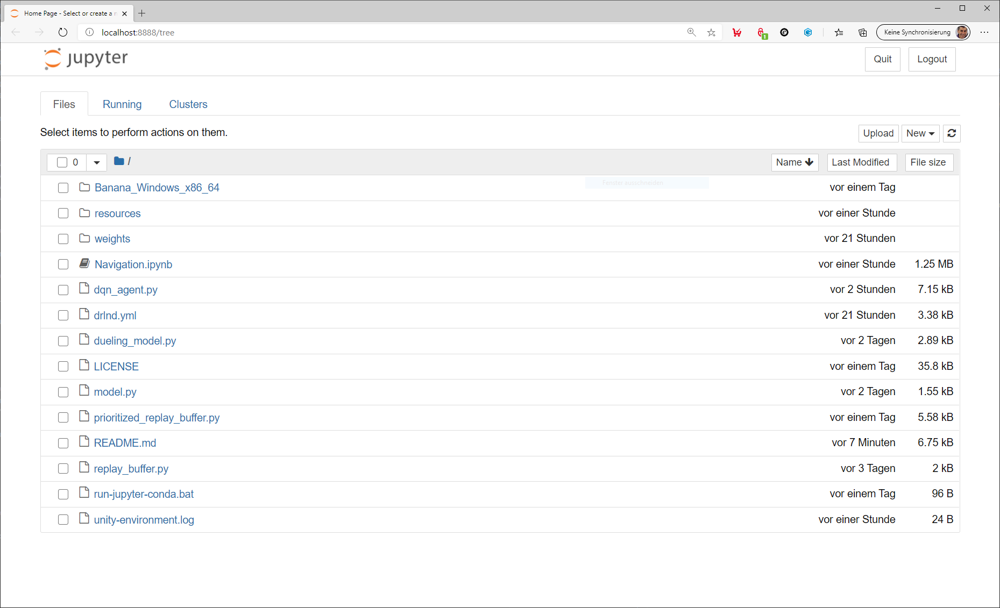
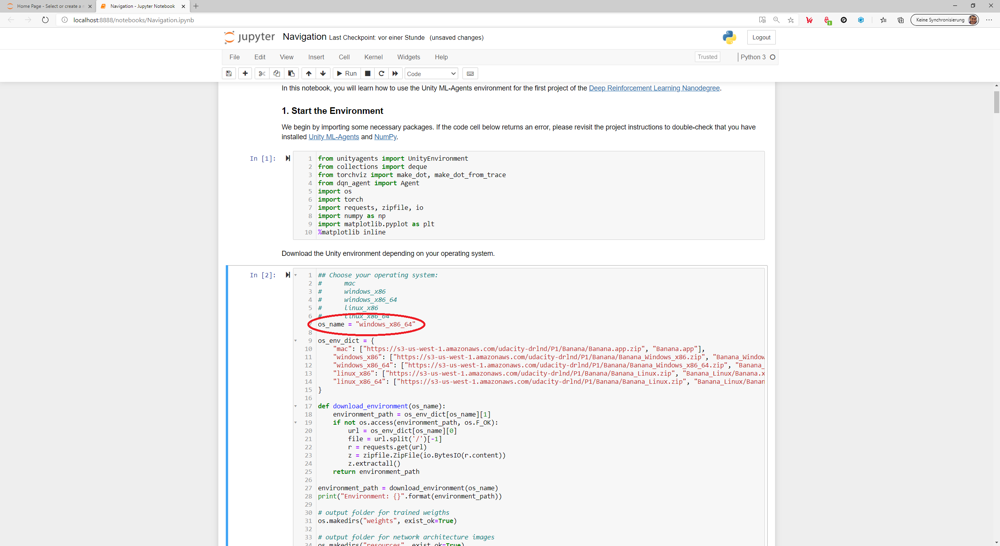

[//]: # (Image References)

[image1]: https://user-images.githubusercontent.com/10624937/42135619-d90f2f28-7d12-11e8-8823-82b970a54d7e.gif "Trained Agent"

# Udacity Deep Reinforcement Learning Nanodegree - Project 1: Navigation

## Introduction

The goal of this project is to create and train an agent who will navigate a large, square world and collect bananas.

![Trained Agent][image1]

### The environment
This environment has been built using the [Unity Machine Learning Agents Toolkit (ML-Agents)](https://github.com/Unity-Technologies/ml-agents), which is an open-source Unity plugin that enables games and simulations to serve as environments for training intelligent agents.  


In this environment, an Agent navigates a large, square world collecting bananas. A reward of **+1** is provided for collecting a yellow banana, and a reward of **-1** is provided for collecting a blue banana. Thus, the goal of your agent is to collect as many yellow bananas as possible while avoiding blue bananas.

The state space has 37 dimensions and contains the agent's velocity, along with ray-based perception of objects around agent's forward direction.  Given this information, the agent has to learn how to best select actions.  Four discrete actions are available, corresponding to:
- **`0`** - move forward.
- **`1`** - move backward.
- **`2`** - turn left.
- **`3`** - turn right.

The task is episodic, and in order to solve the environment, the agent must get an average score of **+13** over **100** consecutive episodes.

## Files included in this repository

The code used to create, train and evaluate the agent:

|File                                                         |Description                                                        |
|:------------------------------------------------------------|:------------------------------------------------------------------|
|[Navigation.ipynb](Navigation.ipynb)                         |Jupyter notebook to train and evaluate the agent                   |
|[dqn_agent.py](dqn_agent.py)                                 |Implementation of the DQN agent                                    |
|[model.py](model.py)                                         |Network architecture used by the DQN agent                         |
|[dueling_model.py](dueling_model.py)                         |Network architecture used by the Dueling DQN agent                 |
|[replay_buffer.py](replay_buffer.py)                         |Implementation of the Replay Buffer                                |
|[prioritized_replay_buffer.py](prioritized_replay_buffer.py) |Implementation of the Prioritized Experienced Replay Buffer        |
|[drlnd.yml](drlnd.yml)                                       |Conda environment file                                             |
|[Report.md](Report.md)                                       |Description of the development process and the learning algorithm  |
|README.md                                                    |This README.md file                                                |

The trained models:

|File                                               |Description                                                         |
|:--------------------------------------------------|:-------------------------------------------------------------------|
|weights/checkpoint.pth                             |Weights of the DQN Agent                                            |
|weights/checkpoint_ddqn.pth                        |Weights of the Double DQN Agent                                     |
|weights/checkpoint_ddqn_dueling_nw.pth             |Weights of the Dueling DQN Agent                                    |
|weights/checkpoint_ddqn_dueling_nw_prioritized.pth |Weights of the Dueling DQN Agent using Prioritized Experience Replay|


## Environment Setup

This section describes how to get the code for this project and how to set up the environment.

### Getting the code

First create a project directory and change to the directory.

Run the following command to clone this repository using GIT

```
$ git clone https://github.com/aboerzel/udacity-deep-reinforcement-learning-p1-navigation.git
```

### Create the environment
The `drlnd.yml` file included in this repository describes all the packages required to set up a [Conda](https://docs.conda.io/projects/conda/en/latest/index.html) environment.
If you haven't installed Conda, download the [Conda installer](https://www.anaconda.com/distribution/) and follow the [installation instructions](https://docs.anaconda.com/anaconda/install/).

Run the following commands to create the environment, this will create an environment named `drlnd`.

```
$ conda env create -f drlnd.yml  
$ conda activate drlnd  
```

## Train and evaluate the Agent

Activate the `drlnd` environment and start the Jupyter Notebook server by running the commands below. A new browser tab will open with a list of the files in the current folder.

```
$ conda activate drlnd
$ jupyter notebook
```

Click on the [Navigation.ipynb](Navigation.ipynb) notebook to open it.  

  

First set the variable `os_name` according to your operating system before you run the notebook cells so that the appropriate Unity environment will be downloaded.

Available options:

* mac
* windows_x86
* windows_x86_64
* linux_x86
* linux_x86_64  



Then execute the notebook cells one after the other with the key combination **SHIFT + ENTER**, starting with cell **1**.

In order to evaluate the agents only with the pre-trained weights, the cells for the training can be skipped. 
The cells for visualizing the network architecture can also be skipped. 
Corresponding information can be found in the comments in the Jupiter Notebook.

### Hyperparameters
The learning process can be influenced by changing the following parameters:  

In the [Navigation.ipynb](Navigation.ipynb) file:  

|Parameter         |Description|
|:-----------------|:----------|
|n_episodes        |Maximum number of training episodes|
|max_t             |Maximum number of timesteps per episode|
|eps_start         |Starting value of epsilon, for epsilon-greedy action selection|
|eps_end           |Minimum value of epsilon|
|eps_decay         |Multiplicative factor (per episode) for decreasing epsilon|
|double_dqn        |Whether or not to use Double Deep Q-Network algorithm|
|dueling_network   |Whether or not to use Dueling Network algorithm|
|prioritized_replay|Whether or not to use Prioritized Experience Replay|


In the [dqn_agent.py](dqn_agent.py) file:

|Parameter                 |Description|
|:-------------------------|:----------|
|BUFFER_SIZE               |Replay buffer size|
|BATCH_SIZE                |Batch size|
|GAMMA                     |Discount factor for expected rewards|
|TAU                       |Multiplicative factor for updating the target network weights|
|LR                        |Learning rate|
|LR_DECAY                  |Multiplicative factor of learning rate decay|
|UPDATE_EVERY              |How often to update the network|
|hidden_layers             |Number and size of the Deep Q-Network layers|
|hidden_state_value_layers |Number and size of the value network of the Dueling Network|
|alpha                     |Determines how much prioritization is used; α = 0 corresponding to the uniform case|
|beta                      |Amount of importance-sampling correction; β = 1 fully compensates for the non-uniform probabilities|
|beta_scheduler            |Multiplicative factor (per sample) for increasing beta (should be >= 1.0)|

