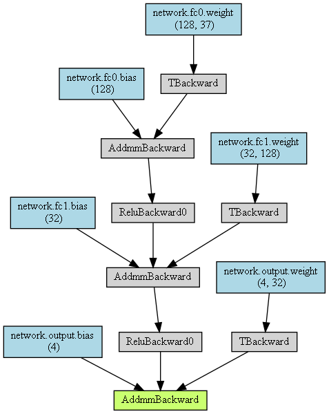
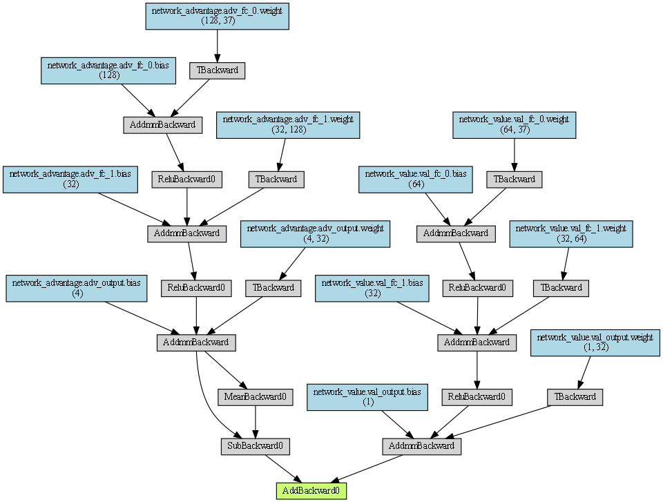
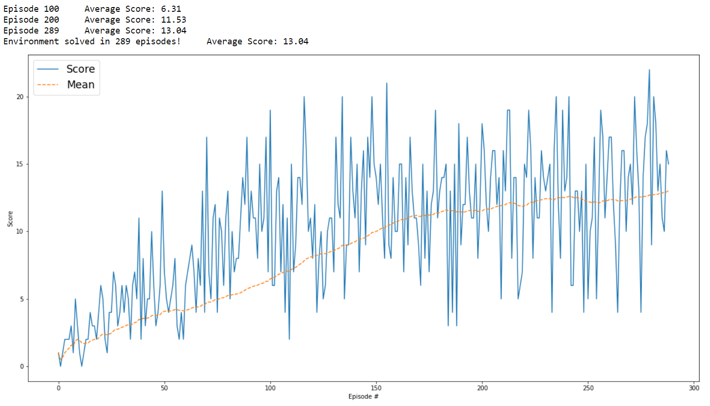
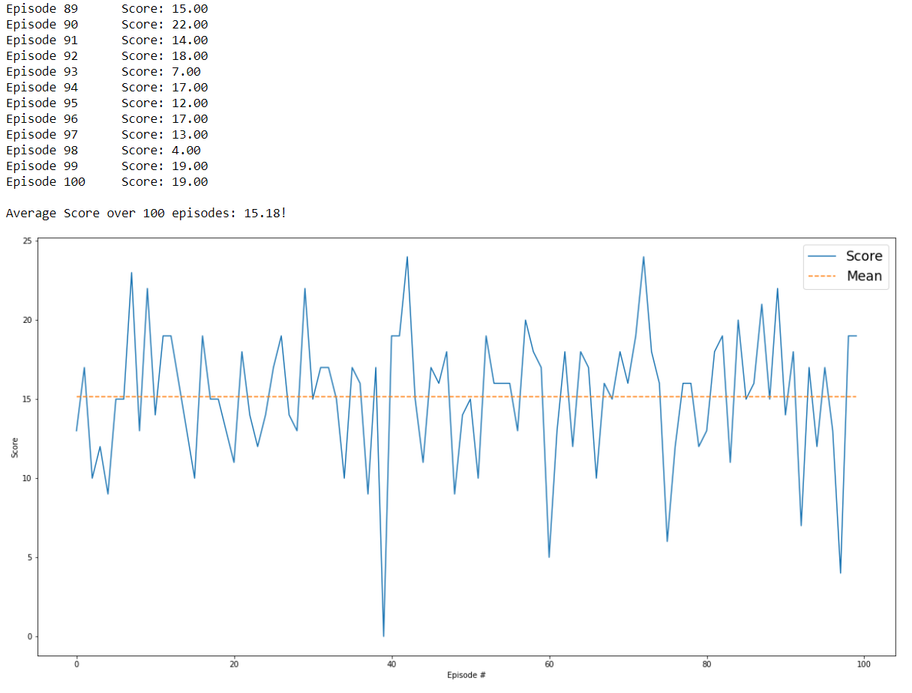

# Udacity Deep Reinforcement Learning Nanodegree - Project 1: Navigation

## Description of the implementation

### Algorithms
In this project I examined the 4 deep reinforcement learning algorithms from lesson 2 "Deep Q-Networks":

* [Deep Q-Network](https://storage.googleapis.com/deepmind-media/dqn/DQNNaturePaper.pdf)
* [Double Deep Q-Network](https://arxiv.org/abs/1509.06461)
* [Dueling Q-Network](https://arxiv.org/abs/1511.06581)
* [Prioritized Experience Replay](https://arxiv.org/abs/1511.05952)

##### Deep Q-Network
I started with the Deep Q-Network (DQN) algorithm using the following Q-Network architecture:  

- Input layer with 37 nodes for the states
- First Fully-Connected layer with 128 nodes
- Second Fully-Connected layer with 32 nodes
- Output layer with 4 nodes for the possible actions (up/down/left/right)
  
 

##### Double Deep Q-Network
Then, I implemented the Double Deep Q-Network algorithm (DDQN), using the same Q-Network architecture as for the Deep Q-Network.

##### Dueling Network
Next I implemented the Dueling Double Deep Q-Network algorithm, which required an expansion of the network architecture:

  

##### Prioritized Experience Replay
Last but not least, I implemented the Prioritized Experience Replay algorithm as a further optimization  

## Training & Evaluation

I trained one agent at a time using the 4 DQN algorithms mentioned above until they got an average score of **+13** in the last **100** consecutive episodes. 
I have also adjusted the hyperparameters to get the best training results.

Then I evaluated each of the agents over exactly 100 episodes and determined the average score.

The following table shows the evaluation results of the different agents:

Agent                                         | # Training Episodes | Average Score (Evaluation 100 Episodes) 
:---------------------------------------------| ------------------: | ---------------------------------------: 
DQN                                           | 388                 | 14.47 
Double DQN                                    | 289                 | 15.18  
Dueling DQN                                   | 237                 | 13.60  
Dueling DQN and Prioritized Experience Replay | 339                 | 14.08  

The results of the different agents are pretty close together, but the **Double DQN Agent** achieved the best result. 
With a relatively short training time of **289** episodes, this achieved an average score of **15.18** in the evaluation over **100** episodes.

I was a bit surprised that the comparatively simple Double Deep Q-Network algorithm outperformed the Double Deep Q-Network algorithm with Prioritized Experience Replay optimization!

### Plot of Rewards
This graph shows the rewards per episode within the training phase of the Double Deep Q-Network Agent, as well as the moving mean.  
It illustrates that the Agent is able to receive an average reward of at least +13 over 100 episodes.  

In this case, the Agent solved the environment after **289 episodes**.

### Evaluation result 
This graph shows the rewards per episode within the evaluation of the Double Deep Q-Network Agent over 100 episodes and the average score.

The following GIF shows the trained Double DQN Agent who collects bananas in the area within an episode.  
<!---->  

## Ideas for Future Work

1. Further hyperparameter tuning may produce better results. 
   

2. The agent's training was stopped here when the target score of +13 was reached. The agents could be trained until there is no longer any significant improvement in the score, so higher score values could be achieved.  

3. Agents with other combinations of the different algorithms could achieve better results, e.g. Double DQN with Prioritized Experience Replay.

4. Use of other network architectures, e.g. more hidden layers or more or fewer nodes per layer.

